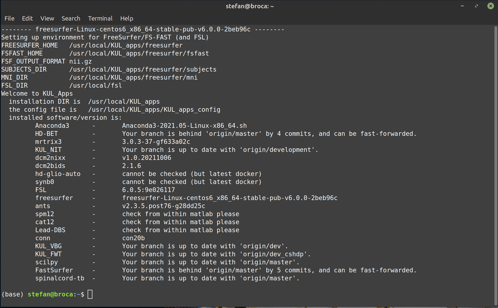

# Here's how to install Neuroimaging Software on Linux, WSL2 and macOS.

This script installs a large number of NeuroImaging related software on Linux (I prefer Linux Mint 21.1, but Ubuntu 22.04 also works).
It is not maintained anymore to install on Windows-WSL2 (latest Win11 preferably) or macOS. Results may vary...

## Which NeuroImaging software

The script installs the latest stable versions of:
- Anaconda3 
- Video Studio Code 
- nvidia cuda 
- mrtrix3 
- FSL 
- Docker
- synb0-DISCO (own improved fork)
- Freesurfer 
- ANTs 
- dcm2niix 
- dcm2bids 
- DCMTK
- GDCM
- SPM12 
- cat12 
- lead-DBS
- conn toolbox 
- KUL_NeuroImaging_tools 
- KUL_VBG
- KUL_FWT
- Scilpy
- FastSurfer
- Mevislab
- Robex
- Spinal Cord Toolbox
- itk-snap

## Output of a terminal after installation

The terminal in WSL2, macOS and Linux will show which version of software is currently installed.

## Prerequisites

### All (but optional)
- Matlab (R2017b or later) - only needed if you use spm12, conn, cat12, lead-dbs

### Linux
- Should run out of the box.
- follow the instructions given by the installer

### Windows with WSL2
- Install win11, perform all updates
- Install nvidia-cuda: follow https://docs.microsoft.com/en-us/windows/ai/directml/gpu-cuda-in-wsl
- Open powershell as administrator and exe: wsl --install
- reboot when asked
- after reboot you will be asked to setup the user/passwd
- INSIDE WIN11: install 
    - visual studio code
    - docker desktop & setup the ubuntu as wsl integration
- open Ubuntu in wsl2
- follow the instructions given by the installer

### macOS
- Should work out of the box
- follow the instructions given by the installer

## Installation notes

Open a terminal.
Copy the following commands into terminal. 

<code> 
wget https://raw.githubusercontent.com/treanus/KUL_Linux_Installation/master/KUL_Install_NeuroImagingSoftware.sh

chmod +x KUL_Install_NeuroImagingSoftware.sh 
</code>

Now run the script

<code> ./KUL_Install_NeuroImagingSoftware.sh </code>

In a first step this will install Anaconda3.
Follow the installation instruction, and accept the license and initialization.
Reboot when asked.

Rerun the script.

<code> ./KUL_Install_NeuroImagingSoftware.sh </code>

Depending on the cpu and the internet connection speed this will take a few hours.

On some occasions you will be asked to enter your password and/or to confirm the installation.

## Post-Install

- The freesurfer license file needs to be installed. Put it in $KUL_apps_DIR/freesurfer_license
- Start matlab, add spm12 and conn to the path. The path for spm12 and conn is $HOME/KUL_apps/spm and conn.
- On macOS open Docker Desktop; in Resources/FileSharing add the folder with the freesurfer license.
